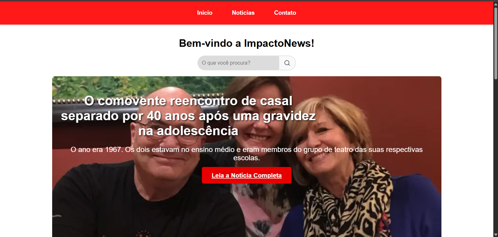

O **ImpactoNews** é um portal de notícias desenvolvido como parte de um Projeto de Linguagem de Marcação. O objetivo principal do projeto foi a aplicação de todos os conceitos de HTML5 e CSS3 aprendidos durante o curso. 

## 📂 Estrutura do Projeto

* `inicio.html`: Página principal com hero section, destaques e sidebar.
* `noticia.html`: Página de detalhe da notícia com download de PDF.
* `contato.html`: Formulário de contato com validação visual e campos personalizados.
* `style.css`: Arquivo único de estilos contendo toda a lógica visual e responsiva.

## 📱 Responsividade

O site é totalmente adaptável:
* **Desktop:** Menu horizontal e Grid de 3 colunas.
* **Tablet:** Grid de 2 colunas.
* **Mobile:** Menu compacto, Grid de 1 coluna e sidebar ajustada.

  Feito por **Lívia Matos**
